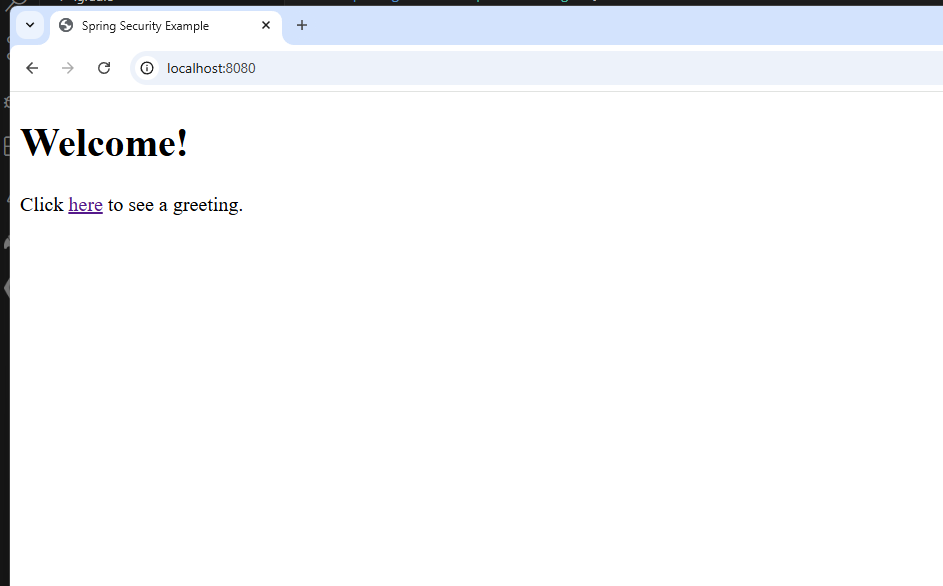
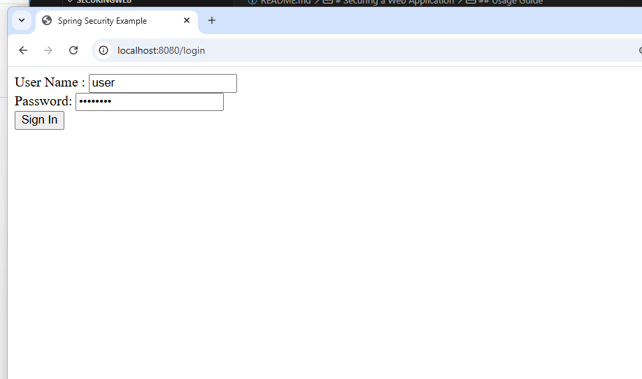
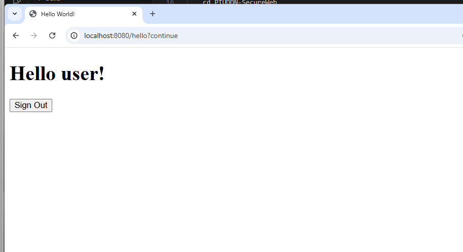
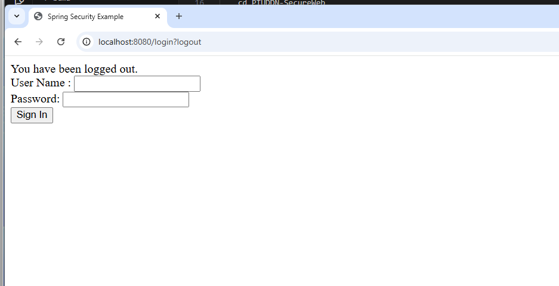

# Securing a Web Application

Name: Lê Tuấn Kiệt  
StudentID: 22024546

## Overview
This project demonstrates how to secure a web application using Spring Boot and Spring Security. It provides basic authentication and authorization features, utilizing a simple in-memory user store.

## Key Features
- User authentication and authorization
- Custom login page
- In-memory user store
- Thymeleaf templates for the user interface

## Installation Guide
1. Clone the repository:
    ```sh
    git clone https://github.com/LTK-Dev/Securing-Web.git
    ```

2. Build the project using Maven:
    ```sh
    mvn clean install
    ```

3. Run the application:
    ```sh
    mvn spring-boot:run
    ```

## Usage Guide
- Access the application at `http://localhost:8080`
- Log in with the following credentials:
    - Username: `user`
    - Password: `password`

## Demo
### Home page:

### After clicking the button, navigate to the login page:

### After login:

### After Signout:

